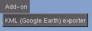
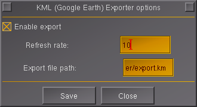

# Add-on usage

Add-on encapsulation for KML protocol. Enabled to export flightpath data and
import it in the Google Earth application

# Installation

Extract zip (if downloaded as a zip) to a given location. For example let's say we have /myfolder/addons/thisaddon with contents of this addon.

Run flightgear with --addon directive or add it in the Launcher application in 'Add-On' section.

# FlightGear configuration

Start FlightGear. Go to menu `Add-on -> KML (Google Earth) exporter`.

There you can enable protocol generation (or stop it at any moment) and define
path for exporting file. The path has to be a file, into which data will
be exported.

Have fun !

